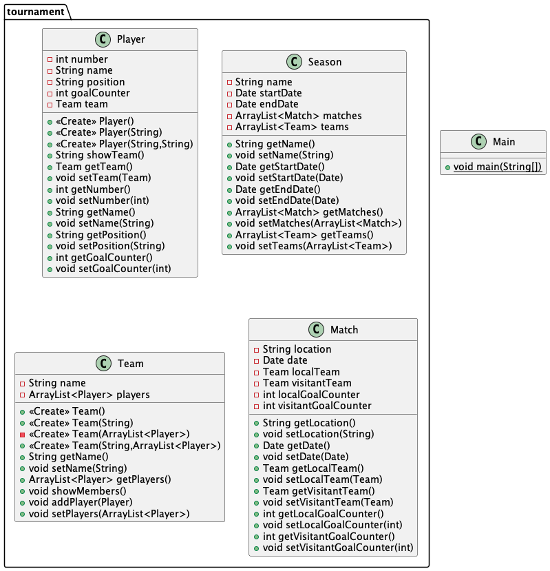

# poo_davinci_tournament

# To Do

## Match class
[-] Incrementar el contador de goles locales en Match. (makeLocalGoal: void -> void)

[-] Incrementar el contador de goles visitante en Match (makeVisitantGoal: void -> void)

[-] Determinar quien es el equipo ganador, no puede haber empates. (getWinner: void -> Team)

[-] Mostrar el marcador del partido. (getMatchStatus: void -> String )

[-] Incrementar el contador de goles del jugador del equipo que hizo el gol. (makeLocalGoal: int -> void)

[-] Incrementar el contador de goles del jugador del equipo que hizo el gol. (makeVisitantGoal: int -> void)

[ ] Agregar constructores de Match

## Main class
[-] Crear Match entre "Equipo A" (local) y "Equipo B" (visitante)

[-] Hacer un gol de local y dos de visitante

[ ] Mostrar el marcado e indicar quien ganó

